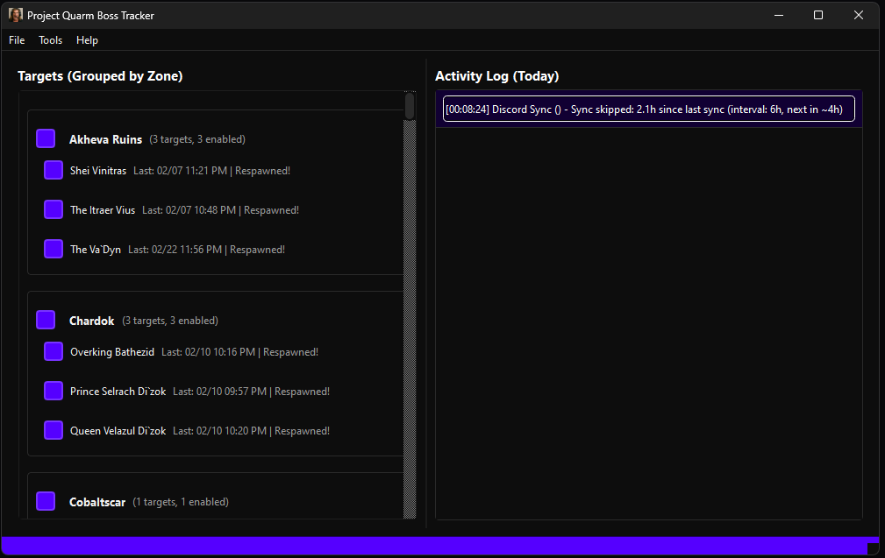
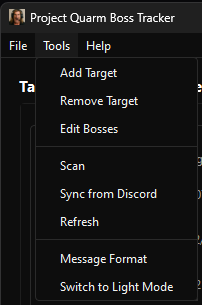

# Project Quarm Boss Tracker

A Windows desktop application that monitors EverQuest (TAKP) log files and sends Discord notifications when tracked bosses are killed. Features automatic boss discovery, zone-based organization, and duplicate detection to prevent spam.

## Features

- **Real-time Log Monitoring**: Automatically detects and monitors active EverQuest log files
- **Auto-Discovery**: Automatically discovers new bosses from guild kill messages and lockout messages
- **Zone Organization**: Targets grouped by zone for easy management with zone-level enable/disable controls
- **Discord Integration**: Sends customizable notifications to Discord via webhooks
- **Duplicate Prevention**: Checks Discord channel for duplicate posts within 3 minutes (accounts for timezone differences)
- **Discord Sync**: Periodically syncs kill times from your Discord channel (configurable interval; requires bot token)
- **Activity Log**: Today’s activity with newest at top; full history stored in database
- **Sound Notifications**: Customizable sound file with optional fanfare on boss kill
- **Customizable Theming**: Light/Dark mode with customizable accent color for buttons and status bar
- **Historical Scanning**: Scan entire log files to discover past boss kills
- **System Tray**: Minimize to tray, optional pop-up on new boss detection (Windows, macOS, Linux)
- **Cross-Platform**: Works on Windows, macOS, and Linux with appropriate desktop environments

## Screenshots

| Main UI | Settings |
|---------|----------|
|  |  |

| Tools menu | Message Format |
|------------|----------------|
|  |  |

## Requirements

- Python 3.8 or higher
- **Windows 10/11**, **macOS**, or **Linux** (with desktop environment)
- EverQuest (TAKP) installation
- Discord webhook URL
- Discord bot token (for duplicate detection and Discord sync)

**Note**: While originally designed for Windows, the application uses PyQt6 which provides cross-platform support. System tray and notifications work on all supported platforms.

## Installation

### Option 1: Installer (Recommended for Windows)

1. **Download the latest installer** from the [Releases](https://github.com/LordDemonos/Project-Quarm-Boss-Tracker/releases) page
2. **Run the installer** (`BossTracker-Setup-vX.X.X.exe`)
3. **Follow the installation wizard**
4. **Launch** the application from Start Menu or Desktop shortcut

The installer will:
- Install the application to `%LOCALAPPDATA%\Programs\Boss Tracker`
- Install a default boss list (all targets enabled) so you can start tracking after setting Discord
- Create Start Menu shortcuts
- Optionally create a Desktop shortcut
- Register the uninstaller in Windows Programs and Features

**Note**: When uninstalling, a dialog appears first: choose whether to **keep your settings and data** (webhook, bot token, boss list, activity log), then click **Uninstall** to continue or **Cancel** to abort. The installer also removes any runtime logs left in the install folder.

### Option 2: Manual Installation (Development)

#### 1. Install Dependencies

```bash
pip install -r requirements.txt
```

**New to the app?** Use **Help** → **Quick Start** in the menu for a short guide with Discord Bot/Token and Webhook URL setup (including optional screenshots).

#### 2. Set Up Discord Integration

The application uses **Discord Webhooks** to post messages and an optional **Discord Bot** for duplicate detection and Discord sync. These are two separate things:

- **Webhook**: Posts messages to a specific Discord channel (required)
- **Bot**: Checks for duplicate messages to prevent spam (optional but recommended)

#### Step 1: Create a Discord Webhook (Required)

A webhook determines **which channel** your messages will be posted to. Each webhook is tied to a specific channel.

1. Open Discord and navigate to your server
2. Go to **Server Settings** → **Integrations** → **Webhooks**
3. Click **"New Webhook"** or **"Create Webhook"**
4. Configure the webhook:
   - **Name**: Give it a name (e.g., "EQ Boss Tracker")
   - **Channel**: **Select the channel where you want boss kill messages to appear**
   - **Avatar**: Optional - customize the webhook's avatar
5. Click **"Copy Webhook URL"** - **Save this URL!** You'll need it in the application settings
6. Click **"Save Changes"**

**Important**: 
- The webhook URL determines which channel messages are posted to
- Each webhook can only post to one channel
- If you want messages in multiple channels, create multiple webhooks (one per channel)
- Keep your webhook URL secret - anyone with it can post to that channel

#### Step 2: Create a Discord Bot (Optional - for Duplicate Detection)

The bot is used to check for duplicate messages and prevent spam when multiple people run the application.

1. Go to [Discord Developer Portal](https://discord.com/developers/applications)
2. Click **"New Application"** and give it a name (e.g., "EQ Boss Tracker")
3. Go to the **"Bot"** section in the left sidebar
4. Click **"Add Bot"** and confirm
5. Under **"Token"**, click **"Reset Token"** and copy the token (you'll need this)
6. Scroll down to **"Privileged Gateway Intents"**
7. Enable **"Message Content Intent"** (required to read message content)
8. Save changes

#### Step 3: Invite Bot to Your Server

1. In Discord Developer Portal, go to **"OAuth2"** → **"URL Generator"**
2. Under **"Scopes"**, select:
   - `bot`
   - `applications.commands` (optional, for future slash commands)
3. Under **"Bot Permissions"**, select:
   - `Read Message History` (required for duplicate detection)
   - `View Channels` (required to access channels)
4. Copy the generated URL and open it in your browser
5. Select your server and authorize the bot
6. Make sure the bot has access to the channel where your webhook posts messages

**Note**: The bot token is stored locally in your settings file. Keep it secure and don't share it publicly.

#### Important: Webhook URL vs Bot Token

**For Guild/Server Use:**

- **Webhook URL (Shared)**: All guild members should use the **same webhook URL** provided by your Discord server admin. This ensures all boss kill messages appear from the same webhook identity in your server's boss tracking channel.
  - **Ask your Discord server admin** for the webhook URL for your server's boss tracker channel
  - The webhook URL determines which channel messages are posted to
  - All users sharing the same webhook URL will have their messages appear from the same webhook name/avatar
  
- **Bot Token (Unique per User)**: Each user should create their **own Discord bot** and use their **own bot token**. This is recommended for:
  - **Rate limiting**: Discord applies rate limits per bot - sharing a token increases the chance of hitting limits
  - **Security**: Each user manages their own bot access independently
  - **Duplicate detection**: Each user's bot checks for duplicates independently
  
**Can you share a bot token?** Technically yes, but it's not recommended. If only a few users are active, sharing might work, but with more users you risk hitting Discord's rate limits. Each user having their own bot token is the recommended setup.

### 3. Configure Application

1. Run the application: `python run.py`
2. Right-click system tray icon → **Options** (or use **File** → **Settings** menu)
3. Configure settings:
   - **Log Directory**: Path to your EverQuest log files (e.g., `C:\TAKP\Logs`)
   - **Discord Webhook URL**: 
     - **For guild use**: Ask your Discord server admin for the webhook URL for your server's boss tracker channel
     - Paste the webhook URL (shared among all guild members)
     - This determines which channel messages are posted to
     - Format: `https://discord.com/api/webhooks/WEBHOOK_ID/WEBHOOK_TOKEN`
   - **Discord Bot Token**: 
     - Create your own bot (see Step 2 above) and paste your **own** bot token
     - Each user should have their own bot token (not shared)
     - Only needed if you want duplicate detection to work
     - Format: Long string of letters and numbers
   - **Discord Sync Interval**: How often to sync kill times from Discord (1–168 hours; requires bot token). Default 12 hours.
   - **Timezone**: Auto-detected from system, or manually select (US, EU, AUS, Asia, and other IANA timezones supported)
   - **12/24-hour time**: Use military (24-hour) or 12-hour AM/PM for times in the UI
   - **Sound**: Enable/disable sound notifications
   - **Sound File**: Browse to select a custom sound file (supports .mp3, .wav, .ogg, .flac) or use "Reset to Default" for the default fanfare
   - **Accent Color**: Click the color button to customize the accent color for buttons and status bar
   - **New Target Default Action**: Choose whether new targets are enabled or disabled by default (default: Enable; with optional auto-posting)
   - **Window Pop-up**: Enable to show window when new boss detected
   - **System Notification**: Enable for system tray notifications (works on Windows, macOS, and Linux)
   - **Backup & Restore**: Create a manual backup of your bosses database, or restore from a previous backup (Settings → Backup & Restore)
4. Click **"Save"**

**How Channel Selection Works**:
- The **webhook URL** you paste determines which channel messages go to
- Each webhook is tied to one specific channel
- To post to a different channel, create a new webhook for that channel and update the URL in settings

### 4. Customize Appearance and Sound (Optional)

- **Accent Color**: In Settings, click the color button next to "Accent Color" to choose a custom color for buttons and the status bar. Your choice is saved and persists across restarts.
- **Sound File**: 
  - Default sound file (`fanfare.mp3`) should be placed in the `assets/` directory when packaged
  - You can select a custom sound file in Settings using the "Browse..." button
  - Supports `.mp3`, `.wav`, `.ogg`, and `.flac` formats
  - Use "Reset to Default" to return to the default fanfare sound
- **Light/Dark Mode**: Switch between themes using **Tools** → **Switch to Light/Dark Mode**. The app detects your OS theme on first run.

### Help Menu

- **Help** → **Quick Start**: One-page guide for Discord Bot/Token and Webhook URL setup (useful for first-time setup or sharing with guild admins).
- **Help** → **About**: Version, release date, and repository link.

## Troubleshooting

**Having issues?** Check `TROUBLESHOOTING.md` for:
- How to enable debug logging (`python run.py --debug`)
- Log file locations
- Common issues and solutions
- How to recover from data loss

**Quick debug mode:**
```bash
python run.py --debug
```

## Testing

Before setting up Discord, test the application with mock mode:

### Run Unit Tests
```bash
python test_utilities/run_all_tests.py
```

### Test with Mock Discord (No Real Discord Needed)
```bash
# Windows PowerShell
$env:EQ_BOSS_TRACKER_MOCK_DISCORD="true"
python run.py

# Windows CMD
set EQ_BOSS_TRACKER_MOCK_DISCORD=true
python run.py
```

In mock mode, Discord messages are logged but not actually posted. Perfect for testing!

### Generate Test Log Files
```bash
# Generate test log file
python test_utilities/test_log_generator.py --output test_logs/eqlog_TestChar_pq.proj.txt

# Point application to test_logs directory to test log monitoring
```

See `TESTING_PLAN.md` for detailed testing procedures.

## Usage

### First Run

1. Start the application - main window opens automatically
2. Configure settings (log directory, Discord webhook, bot token)
3. The application will automatically discover bosses as they appear in log files

### Auto-Discovery

When a new boss is detected in log files:
- The target is automatically added to the appropriate zone group
- Behavior depends on your "New Target Default Action" setting:
  - **Enable by default**: New targets are automatically enabled and will post to Discord immediately
  - **Disable by default**: New targets are added but disabled (no popup dialog)
- If "Enable by default" is selected, the current kill is posted immediately
- A system notification may appear if enabled in settings (works on Windows, macOS, and Linux)
- The main window may pop up if enabled in settings

### Managing Targets

- **Enable/Disable**: Check/uncheck individual target checkboxes
- **Enable/Disable Zone**: Check/uncheck the checkbox next to the zone name to enable/disable all targets in that zone
- **Enable/Disable All**: Use the "Enable All" or "Disable All" buttons at the top to control all targets across all zones
- **Add Target**: Use **Tools** → **Add Target** to manually add a target
- **Remove Target**: Use **Tools** → **Remove Target** to remove a selected target
- **Scan Log File**: Use **Tools** → **Scan** to scan an entire log file for historical boss kills (adds them disabled by default)

### Activity Log

- **Activity Log (Today)** shows today’s detected boss kills; newest entries appear at the top. Your scroll position is preserved when new messages arrive.
- Full history is stored in the database.
- Format: `[timestamp] Target (Zone) - Status`
- Status indicators:
  - "Posted to Discord" - Successfully posted
  - "Duplicate detected, skipped" - Duplicate found, not posted
  - "Disabled" - Target is disabled, not posted
  - "New boss detected" - New target discovered
- Scan progress and summaries are also shown in the Activity Log.

### Window Behavior

- **Pop-up on New Boss**: If enabled, window becomes visible when new target detected
- **Minimize to Tray**: Click minimize to hide window to system tray
- **Restore**: Double-click tray icon or right-click → **Show Window**
- **Window State**: Window size, position, splitter divider position, and **Targets by Zone** scroll position are saved and restored on restart
- **System Tray Menu**: Right-click tray icon for quick access to Settings, Message Format, Refresh, and Exit

## Message Format

The application parses two types of messages:

### Primary Format: Guild Kill Messages

```
[Sat Jan 31 23:30:48 2026] Druzzil Ro tells the guild, 'Orez of <Former Glory> has killed Rhag`Zhezum in Ssraeshza Temple!'
```

- **Target**: Extracted between "killed" and "in" (e.g., "Rhag`Zhezum")
- **Zone**: Extracted between "in" and "!" (e.g., "Ssraeshza Temple")
- **Timestamp**: Parsed from log message (EST/server time)

### Fallback Format: Lockout Messages

If the guild message isn't found, the application also checks for lockout messages:

```
[Mon Jan 12 22:01:42 2026] You have incurred a lockout for Emperor Ssraeshza that expires in 6 Days and 18 Hours.
```

- **Target**: Extracted from "lockout for [Target]"
- **Zone**: Set to "Lockouts" (since lockout messages don't include zone information)
- **Timestamp**: Parsed from log message (EST/server time)
- These targets use a separate message template (configured in Message Format Editor)

### Discord Timestamp Formatting

The application uses Discord's timezone-aware timestamp format, which automatically displays in each viewer's local timezone:

- `<t:unix_timestamp:F>` - Full date/time (e.g., "Saturday, January 31, 2026 11:30 PM")
- `<t:unix_timestamp:R>` - Relative time (e.g., "2 minutes ago")
- `<t:unix_timestamp>` - Default format

**Message Template Variables**:
- `{discord_timestamp}` - Full date/time format
- `{discord_timestamp_relative}` - Relative format ("2 minutes ago")
- `{timestamp}` - Original log timestamp string
- `{monster}`, `{note}`, `{player}`, `{guild}`, `{location}`, `{server}` - Other variables (`{note}` is used for boss variants, e.g. Vex Thal notes)

**Example Message**:
```
<t:1735699848:F> Rhag`Zhezum was killed in Ssraeshza Temple!
```

This will display in each Discord user's local timezone automatically.

## Discord Deduplication

To prevent spam when multiple people run the application:

1. Before posting, the app checks Discord channel for recent messages
2. Looks for same target name within last 3 minutes
3. Accounts for timezone differences:
   - Server time: EST (from log timestamps)
   - User timezone: Auto-detected from system (can be manually set)
   - Converts Discord message timestamps to EST for comparison
4. If duplicate found: Skips posting, logs "Duplicate detected, skipped"

**Note**: Requires Discord bot token with "Read Message History" permission.

## Timezone Configuration

The application automatically detects your system timezone, but you can manually override it in settings:

1. Go to Settings
2. Find "Timezone" field
3. Select your timezone from dropdown (or leave as "Auto-detect")
4. Save settings

**Why this matters**:
- Log timestamps are in EST (server time)
- Your timezone is used to convert timestamps for Discord
- Discord timestamps automatically adjust to each viewer's timezone
- Ensures accurate duplicate detection across different timezones

## Configuration Files

Settings and data files are stored in OS-specific user data directories:

- **Windows**: `%APPDATA%\boss tracker\`
- **macOS**: `~/Library/Application Support/boss tracker/`
- **Linux**: `~/.config/boss tracker/`

Files:
- `settings.json` - Application settings (webhook URL, bot token, theme, accent color, Discord sync interval, etc.)
- `bosses.json` - Boss database (enable/disable status, respawn times, notes; all bosses use the webhook from settings)
- `activity.json` - Activity log (full history)
- `backups/` - Automatic and manual backups of `bosses.json` (used by Settings → Restore from Backup)
- `logs/` - Application log files

**Note**: Sensitive fields (webhook URLs, bot tokens) are encrypted in the settings file.

## Building Installer

### Automated Build (GitHub Actions)

The installer is automatically built when you create a GitHub release. The **version number is taken from the release tag** (e.g. tag `v1.2.3` → installer `BossTracker-Setup-v1.2.3.exe` and About dialog show 1.2.3).

1. Create a tag: `git tag v1.0.0` (or the version you want)
2. Push the tag: `git push origin v1.0.0`
3. On GitHub, go to **Releases** → **Create a new release**, choose that tag
4. Publish the release — GitHub Actions builds the installer and attaches it to the release

### Manual Build

1. **Install dependencies**:
```bash
pip install -r requirements.txt
pip install pyinstaller
```

2. **Install Inno Setup**:
   - Download from https://jrsoftware.org/isinfo.php
   - Or use Chocolatey: `choco install innosetup`

3. **Build installer**:
```bash
python build_installer.py
```

The script will:
- Extract version from git tag, `version.txt`, or environment variable
- Build executable using PyInstaller
- Compile installer using Inno Setup
- Output: `dist/BossTracker-Setup-vX.X.X.exe`

**Note**: The old MSI build script is in `docs/archive/build_msi.py` (deprecated). Use `build_installer.py` instead.

## Troubleshooting

### Messages Not Posting to Discord
- **Verify webhook URL is correct**: Check that you copied the full webhook URL from Discord
- **Check webhook channel**: Make sure the webhook hasn't been deleted or the channel hasn't been removed
- **Test webhook**: You can test your webhook URL by pasting it in a browser (it should show webhook info) or using a tool like [Discord Webhook Tester](https://discord.com/api/webhooks/)
- **Check application logs**: Look in the `logs/` folder in your user data directory (see **Configuration Files** above for paths) for error messages about Discord posting

### Bot Can't Read Messages (Duplicate Detection)
- Ensure "Message Content Intent" is enabled in Discord Developer Portal
- Check bot has "Read Message History" permission in the channel where webhook posts
- Verify bot token is correct in settings
- Make sure bot was invited to the server and has access to the channel

### Wrong Channel Receiving Messages
- **The webhook URL determines the channel**: Each webhook is tied to one specific channel
- To change channels: Create a new webhook in the desired channel, copy its URL, and update it in settings
- You can have multiple webhooks for different channels, but the application currently uses one default webhook URL

### No Targets Detected
- Check log directory path is correct
- Verify log files match pattern: `eqlog_*_*.txt`
- Check log file is being written to (most recent modification time)
- Check application logs for parsing errors

### Duplicate Detection Not Working
- Verify bot token is set in settings (optional - duplicate detection won't work without it)
- Check bot has access to the channel where webhook posts messages
- Ensure "Message Content Intent" is enabled in Discord Developer Portal
- Note: Duplicate detection is optional - messages will still post without it

### Window Not Showing
- Check "Window Pop-up on New Boss" setting
- Try double-clicking system tray icon
- Check if window is minimized to tray
- Right-click system tray icon → **Show Window**

### Accent Color Not Persisting
- Make sure you click "Save" after selecting a color
- Check the log file for debug messages about accent color loading
- The color should persist across restarts - if not, check that `accent_color` is in your `settings.json` file

### Sound File Not Playing
- Verify the sound file path is correct in Settings
- Check that the file format is supported (.mp3, .wav, .ogg, .flac)
- Ensure "Enable sound notifications" is checked
- For default sound, make sure `fanfare.mp3` exists in the `assets/` directory (when packaged)

## License

MIT License. See [LICENSE](LICENSE) in the repository for the full text.

## Contributing

Contributions welcome! Please open an issue or submit a pull request.

## Support

For issues or questions, please open an issue on GitHub.
